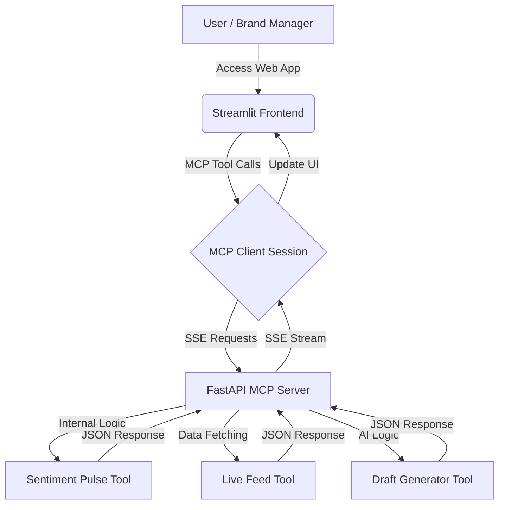

# 🛰️ SentinelStream MCP — Brand Intelligence Engine

🔗 **Live Demo:** https://sentinel-stream-343827421929.us-central1.run.app/

An enterprise-grade real-time brand intelligence dashboard that leverages the **Model Context Protocol (MCP)** to bridge live social data feeds with AI-driven sentiment analysis.

This system provides businesses with a **“Sentinel Pulse”** — a real-time indicator of their digital reputation using intelligent insights and automated response generation.

---

## ✨ Features

- **🛡️ Real-time Sentiment Gauge**  
  A dynamic glassmorphic needle gauge that visualizes brand health on a scale of 0–10.

- **📡 Live Mention Scanning**  
  Aggregates real-time brand mentions from digital feeds using MCP tools.

- **🧠 AI-Powered Sentiment Analysis**  
  Understands tone and context to classify brand perception as positive or negative.

- **✍️ Strategic AI Drafts**  
  Automatically generates PR-ready responses for social mentions.

- **⚡ MCP Architecture**  
  Decoupled client-server communication using Server-Sent Events (SSE).

- **🎨 Premium UI/UX**  
  Dark-mode interface with glassmorphism, responsive design, and smooth animations.

---

## 🧪 Recommended Keywords for Testing

Use these sample brand keywords to explore different sentiment behaviors and fully test the system:

- **🍔 Swiggy
  Best for real-time customer feedback simulation with mixed sentiment.

- **🍽️ Zomato
  Great for comparing sentiment trends alongside Swiggy.

- **🚗 Tesla
  Ideal for observing dynamic sentiment shifts (positive + negative mix).

- **🍎 Apple
  Useful for testing strong positive sentiment scores.

- **🔍 Google
  A stable baseline for consistent tech-related sentiment.

- **📦 Amazon
  Perfect for analyzing detailed and diverse social mentions.

- **💄 Nykaa
  Best for lifestyle and fashion category sentiment testing.

- **☕ Starbucks
  Helps evaluate premium brand perception scoring.

- **🎬 Netflix
  Great for entertainment-based sentiment fluctuations.

- **💻 Microsoft
  Represents professional and steady corporate sentiment.

---

## 🏗️ Architecture



---

## 🚀 Local Development

### 1. Install Dependencies
```
pip install -r requirements.txt
```

### 2. Start MCP Backend
```
python -m uvicorn server:app --host 0.0.0.0 --port 8081
```

### 3. Start Frontend Dashboard
```
python -m streamlit run app.py
```

---

## ☁️ GCP Deployment (Cloud Run)

```
gcloud run deploy sentinel-stream \
  --source . \
  --project numeric-vehicle-495215-v2 \
  --region us-central1 \
  --allow-unauthenticated
```

---

## 🛠️ Tech Stack

| Layer        | Technology |
|-------------|-----------|
| Frontend    | Streamlit, HTML5, CSS |
| Backend     | Python, FastAPI |
| Protocol    | MCP (SSE) |
| Deployment  | Google Cloud Run |
| Container   | Docker |

---

## 📂 Project Structure

```
sentinelstream-mcp/
├── app.py
├── server.py
├── requirements.txt
├── Dockerfile
├── start.sh
└── README.md
```

---

## 📖 Usage Guide

1. Enter brand keyword (e.g., Swiggy, Zomato)  
2. Click **INITIALIZE LIVE FEED**  
3. Analyze sentiment  
4. View results and AI-generated responses  

---

## 🗺️ Roadmap

- [ ] Reddit/X API integration  
- [ ] Multi-keyword comparison  
- [ ] Historical tracking  
- [ ] Alerts system  

---

## 👤 Author

Priasha Patle  
priashapatle@gmail.com
